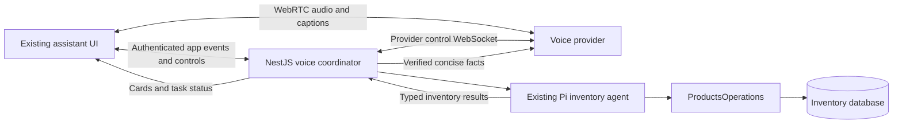

Inventory assistant: live voice feature plan

> Implementation update (16 September 2026): the initial provider evaluation below is superseded by the implemented LiveKit + Groq Whisper Turbo + existing NestJS/Pi + Rumik Mulberry flow. No acknowledgement clips or second model are used. The browser has a translucent voice overlay above the scrollable chat. A Python worker in `evol-backend/voice-worker` handles audio; see its README for startup, configuration and deployment. Voice disables typing until the call ends. The existing Pi run returns chat text and a short `speechText`; inventory remains tool-produced data. This document's earlier GPT-Live architecture is retained only as historical planning, not deployment instructions.

Prepared 16 September 2026 from the current working trees of `operations-management` and `evol-backend`. This is a proposed design; no live provider access, audio performance, or deployment behavior has been tested. Backend working-tree changes in `agent.types.ts` and `inventory.tools.ts` were included in the review.

Recommendation: add an opt-in voice mode to the existing `/assistant` conversation. Users speak continuously, see inventory cards in the same feed, and hear brief grounded replies. Preserve the Pi inventory agent and its authorization boundary. Evaluate GPT-Live client delegation over WebRTC as the first implementation candidate; make the production choice after an end-to-end spike establishes project access, language quality, latency, and cost.

Assumptions awaiting product input: internal staff, the current read-only inventory scope, responsive desktop and mobile use, and evaluation with English plus Hindi/Hinglish. Language support is a release criterion to validate, not an established model guarantee.

**Existing foundation**

| Area | Current implementation | Consequence for voice |
| --- | --- | --- |
| Client | Next.js 16.2.11, React 19, TanStack Query, Shadcn, Tailwind | Extend existing components and theme; keep microphone/media state in a dedicated hook. |
| Chat | `components/agent/InventoryChat.tsx`, `useInventoryChat.ts`, `lib/agentApi.ts` | One POST per turn; NDJSON events; a request-level AbortController. A persistent voice session needs its own lifecycle. |
| Cards | `InventoryResults.tsx`, `AgentInventoryResult` | Reuse typed results and rendering, adding stable result IDs and visible item numbers. |
| Backend | NestJS/Express on Bun, Pi 0.85.1 | Call the existing agent service internally through an adapter. No need for backend-to-backend HTTP to its own message endpoint. |
| Model | Configurable; code defaults to OpenCode Go / `glm-5.3-flash` | Voice does not require replacing this model. Its actual production configuration and latency remain to be measured. |
| Tools | `search_inventory`, `get_inventory_item` through `ProductsOperations` | Retain Zod validation, current-session checks and role-filtered fields. Search defaults to six items and caps pages at twelve. |
| Persistence | PostgreSQL `agent_sessions` and native Pi `agent_session_entries` | Display messages are derived from Pi entries; voice-only conversation and spoken paraphrases are not represented today. |
| Concurrency | 120-second DB run lease, 60-second agent deadline | Keep one active inventory run per conversation; do not hold this lease for an entire voice call. |
| Hosting | Frontend has Cloudflare/OpenNext configuration; backend deployment docs describe EC2/Docker/Traefik | Put long-lived provider control connections in the backend process. Verify proxy behavior and shutdown recovery on the deployed stack. |

**Product behavior**

1. The composer offers a clearly labelled **Start voice** button. Clicking it requests microphone access and establishes a session for the current conversation. Never start capture on page load.
2. During voice, a compact bar above the composer shows connection state, microphone state, search activity and output activity. Listening and speaking can overlap, so do not implement all states as one mutually exclusive status enum.
3. Controls are **Mute microphone**, **Stop speaking**, and **End voice**. Muting input does not cancel a search or stop output. Stop speaking stops playback and updates conversation behavior without pretending a search was canceled. End voice closes the session and cancels/suppresses any pending voice-originated work under the policy below.
4. User speech appears as growing captions; result cards arrive directly from backend tool results; assistant captions represent its spoken output. Avoid displaying both Pi's answer and the voice model's paraphrase as duplicate assistant replies.
5. The assistant speaks one or two useful sentences, then yields: “I found twelve matching rings. Here are the first six. Would you like to narrow the weight range?” It should not read every card or repeat markdown formatting.
6. Follow-ups preserve filters and context: “only eighteen karat,” “under five grams,” “show more,” and “where is number two?” Bind numbered references to a specific visible result set and exact product code; ask if the reference is ambiguous.
7. Users can interrupt and correct themselves. “Under fifty thousand — actually thirty thousand” updates the active request. Only the current revision may publish a new result or spoken factual answer.
8. Keep typing available for exact codes and noisy environments. Typed input during voice goes through the same coordinator and produces one response. Do not independently trigger the old text endpoint and the voice backend for the same input.
9. Switching conversations, leaving the assistant, or signing out ends voice and releases microphone tracks. Returning requires an explicit Start/Resume action. A later version can support voice across inventory navigation if needed.
10. Permission failure, unsupported media, connection loss, and blocked audio playback produce an actionable inline message. The existing chat remains usable. Reconnect restores context without silently replaying an inventory request or restarting capture after the user ended it.

Use current typography, semantic theme colors, borders and card spacing. Keep cards usable during conversation; use a small level meter rather than a modal covering the results. Reuse Shadcn buttons/tooltips and Lucide icons. Provide 44px targets, keyboard access, visible focus, labelled toggle states, reduced motion and a stable caption region. Avoid screen-reader announcements for every transcript token; announce meaningful status changes and completed display groups.

Prices remain catalog INR prices, weights grams, and purity karats. Clarify ambiguous amounts and codes instead of guessing. There is currently no location-name resolver or price-sort parameter: do not promise arbitrary named-location filtering or globally cheapest results until those capabilities are explicitly added.

V1 excludes order/enquiry writes, reservations, custom estimates, wake words, background listening, phone calls and stored audio replay. Provide a short visible AI-voice disclosure and tell users that transcripts are saved with the conversation. Store no raw audio in the application by default; configure provider recording storage separately and document applicable provider retention.

**Architecture choice**

| Approach | Fit | Tradeoff |
| --- | --- | --- |
| GPT-Live with client delegation | Preferred spike: conversational voice delegates to existing Pi agent | Application must own transcript assembly, context, scheduling and result correlation. Project access and supported SDK/runtime need verification. |
| Realtime API with backend tools | Alternative for direct speech/tool interaction | Reuse `ProductsOperations`, but build a separate voice orchestration path. A wrapper around the existing Pi agent can reduce duplication at the cost of another model hop. |
| Streaming speech-to-text → Pi → text-to-speech | Useful when deterministic intermediate text or incremental delivery is the priority | More stages and application-managed turn detection/interruption; measure end-to-end latency. A record/upload/play workflow alone does not satisfy continuous voice. |

OpenAI currently documents GPT-Live client delegation as supporting an application-owned backend using any model/provider. This matches the existing Pi/OpenCode implementation. The recommendation is based on that architectural fit, not measured superiority in this application. [Voice architectures](https://developers.openai.com/api/docs/guides/voice-agents), [client delegation](https://developers.openai.com/api/docs/guides/live-delegation).

Browser audio travels directly over WebRTC. The backend establishes and controls the provider session, owns private tool execution and supplies verified results. The frontend never receives a long-lived provider key. The app event stream carries cards and task state rather than audio. [WebRTC connection](https://developers.openai.com/api/docs/guides/voice-webrtc?api=live), [server controls](https://developers.openai.com/api/docs/guides/voice-server-controls?api=live).

For GPT-Live specifically, the backend exchanges the browser's SDP offer through `POST /v1/live/sessions`, selects client delegation and attaches to the returned provider session. Keep provider session creation, configuration and ownership mapping server-side. Attach promptly so early events are not lost; gate task readiness until the coordinator is attached. Verify this startup race in the spike.

Do not conflate GPT-Live with the Realtime API: their endpoints, session IDs and event contracts differ. The `@openai/agents/realtime` starter describes Realtime; do not assume it supports Live. Use a current SDK with confirmed Live support or the documented transport contract, validating Bun compatibility.

**Backend implementation**

Add focused voice controller, provider connection and coordinator modules under `src/app/agent/`. Register them in `app.module.ts`; add validated server-only voice configuration, feature flags and budget limits.

Proposed application endpoints, distinct from provider API endpoints:

| Endpoint | Purpose |
| --- | --- |
| `POST /api/v1/agent/sessions/:id/voice` | Authenticate, authorize, enforce one active voice session, accept bounded SDP JSON and create a connection. Return an app voice-session ID and SDP answer. |
| `GET /api/v1/agent/sessions/:id/voice/:voiceId/events?after=...` | Authenticated resumable event stream for display updates, results and status; use streaming fetch with credentials and heartbeat events. |
| `POST /api/v1/agent/sessions/:id/voice/:voiceId/input` | Submit typed input or an explicit correction/selection through the active coordinator. |
| `POST /api/v1/agent/sessions/:id/voice/:voiceId/control` | Validated controls such as microphone state, stop output and cancel current request; make repeated commands safe. |
| `POST /api/v1/agent/sessions/:id/voice/:voiceId/end` | Idempotent server cleanup and usage finalization. |

Reuse the existing ownership/access-scope checks for every route. Check origins and CSRF protection on cookie-authenticated mutations, including session creation. Revalidate login, role and status before every tool operation and before publishing protected results; also monitor expiry/revocation during a long connection. Cookies and identity come from the server's authenticated connection context, never model input. Disable voice and clear protected local state when access is lost.

Reuse `InventoryAgentService.prepare/run` through an internal adapter. Its current event callback is a useful seam, but extend the internal result to distinguish completed, canceled, failed and superseded work and expose a concise verified outcome. Do not reimplement search or bypass `ProductsOperations`.

Keep Pi's native history and checkpoints for its reasoning/tool continuation. Add a small provider-independent display log and voice-session metadata, rather than forcing audio transcripts into native Pi entries:

- Voice session: parent conversation, owner/scope, provider session ID, state, start/end, connection lease/last heartbeat, final usage and close reason. No credentials.
- Display events/messages: stable message/event ID, conversation/voice IDs, sequence, speaker, source, transcript time interval and revision, interruption state, optional inventory result. Deduplicate by source event ID and correlate Pi entries to display rows.
- Task correlation: app request ID and revision, provider delegation ID, Pi run ID and result-set ID. Store correlation with the display/task metadata; a separate general workflow engine is unnecessary for V1.

Project existing Pi messages into the display log using deterministic source IDs, with a migration or idempotent lazy backfill. Text requests continue to populate the same display history. For voice, store Pi's internal answer as backend context and show the actual output transcript as the assistant reply. Handle a run that completes without a spoken reply with a clear factual result/status, not fabricated speech.

The current `done` event replaces the full UI message list. Introduce stable message/result IDs and upsert/reconciliation semantics so ending one tool run cannot erase ongoing voice captions. Resume from a cursor, or reload an authoritative snapshot when history is no longer replayable.

Important GPT-Live constraint: `session.delegation.created` supplies metadata, not the user's utterance. Maintain timestamped input/output transcript fragments and current application context. Build each Pi request from relevant context at the delegation offset and subsequent corrections. Transcript deltas have no authoritative turn-completed event; display grouping must remain revisable and must not itself launch tools. A missing transcript event is not proof of silence. [Delegation contract](https://developers.openai.com/api/docs/guides/live-delegation), [transcript contract](https://developers.openai.com/api/docs/guides/live-conversations#transcript-deltas).

Keep the coordinator as the only execution owner even when both browser and backend observe provider events. Deduplicate delegation requests, serialize inventory runs, and keep only the latest superseding correction pending. Increment the request revision on a semantic correction, abort the old Pi run, await lease release, then execute the replacement. Since DB reads may not be cancellable, discard late results whose revision no longer matches. Ordinary speech overlap or an acknowledgment such as “okay” must not automatically cancel a search.

Preserve previously displayed results, labelling an interrupted/superseded search when appropriate. Never send stale output back to the voice model as a current answer. On reconnect or mode switch, seed the voice model and Pi adapter with authorized recent conversation, active filters and the exact displayed result order. Recheck inventory facts with tools when answering follow-ups, following current instructions.

**Frontend implementation**

- `InventoryChat.tsx`: add entry point, active voice bar, transcript treatment and UI selection context.
- New `useInventoryVoice.ts`: WebRTC negotiation, microphone tracks, output playback, provider event handling, cleanup and recovery. Keep the connection in refs rather than rerendering on each audio frame.
- New `VoiceControls.tsx`: accessible controls and independent input/output/connection/task status.
- `useInventoryChat.ts`: share the canonical message store/reducer and route typed messages according to active mode; keep one conversation/run coordinator.
- `InventoryResults.tsx`: reuse cards, add stable numbered references and result-set identity; retain existing authorized media fetches.
- `lib/agentApi.ts` and `types/agent-api.ts`: application voice API, validated event envelope and stable identifiers. Keep provider-specific event schemas isolated in the voice adapter.

Existing `RequirementMediaRecorder.tsx` provides examples of permissions and track cleanup. It records uploadable blobs; it is not the live conversational transport.

Use direct provider captions for responsiveness and server events for authoritative task/cards/history. Merge by stable IDs and timestamps to avoid duplicates from two event paths. Do not infer that audio was heard from a transcript event or context-append acknowledgment. Track playback and interrupted output separately where observable.

Microphone mute should stop transmitting captured audio locally as well as update provider input state. Stop output should immediately silence local playback, steer the model to yield and prevent queued speech from resuming. End should release local tracks immediately and allow bounded server-side close/usage finalization. Handle missing final usage as incomplete rather than zero.

**Delivery sequence and acceptance**

| Phase | Concrete outcome | Planning estimate |
| --- | --- | --- |
| 1. Feasibility spike | Synthetic inventory request speaks in, calls the existing Pi adapter, renders a card and speaks a verified reply; test one correction mid-search. Verify project access, SDK/Bun support and target languages/devices. | 1–2 engineer-days |
| 2. Shared contracts/history | Stable event IDs, display persistence, typed-input routing, task revisions and safe migration/backfill; existing text conversation still restores. | 2–3 days |
| 3. Backend voice integration | Authenticated connection lifecycle, sideband delegation, current-scope tools, result correlation, limits and disconnect cleanup. | 3–5 days |
| 4. Client experience | Voice controls, streaming captions, cards, interruption, mute/end, mobile layouts and readable error recovery. | 3–4 days |
| 5. Pilot and hardening | Browser/network/noise testing, failure injection, usage telemetry, internal feature flag and rollout criteria. | 2–4 days |

Approximately 11–18 engineer-days for one engineer familiar with both repos; this is an estimate, not a delivery commitment. Language accuracy, mobile audio behavior, SDK support and latency of the current backend model are the main variables. Re-estimate after phase 1.

Release scenarios should cover filtered search, pagination, exact barcode with leading zeros, numbered references, ambiguous amounts, no results, and spoken output matching authorized tool facts. Include role change during a call, logout, another user's session ID, two tabs, duplicate events, late results, interrupted output, interrupted search, microphone denial, autoplay failure, dropped network, backend restart and mode-switch context restoration. Verify both the UI and actual playback.

Suggested initial targets to validate in the spike: p50 under 1.5 seconds for a useful acknowledgment after a completed question; p50 under 4 seconds and p95 under 8 seconds for first relevant cards/useful factual speech on simple searches; p95 under 500ms to yield audible output after an interruption. Define timestamps from observed audio/end-of-utterance and client playback, not transcript packet arrival. Report acknowledgments separately from useful answers, along with correctness and request complexity. These are proposed targets, not measured results or API guarantees.

Measure voice starts/completions, permission/connection failures, tool durations, stale-result suppression, first-card time, first-useful-audio time, interruption delay, correction rate, and cost per successful task. Log identifiers and timing by default; avoid transcript contents and credentials in general telemetry.

Existing tests already cover authorization, validation, persisted context and run leases. Extend those tests with voice ownership, idempotency, revisions and reconnection. Add reducer tests for overlapping transcript fragments and late results, plus real-browser/media checks. At implementation time run `bun run build`, relevant backend tests, and `pnpm build`; do not run `pnpm lint` per repository instructions.

**Operations and cost**

Start with the existing backend process and PostgreSQL; no additional media server or job queue is required for this browser-first design. Add session heartbeat/expiry and startup cleanup for orphaned connections. The documented deployment replaces containers automatically, so handle graceful close, interrupted tasks and user-visible reconnect. Verify event streaming is not buffered by Traefik and load-test active control sockets. Revisit process ownership/routing before adding backend replicas; in-memory session registries alone will not work across arbitrary workers.

GPT-Live voice time is billed while the session is active, including silence and backend wait time; backend model charges are separate. Start sessions only on user intent, close on End/navigation, apply a configurable idle warning and timeout, and cap concurrent sessions and session duration. Muting does not stop billing. Measure cost from final provider usage plus existing backend usage; a provider subscription does not imply unlimited voice usage. Confirm current rates for the actual project before budgeting. [Cost accounting](https://developers.openai.com/api/docs/guides/voice-latency-cost?api=live).

Recommended first implementation step: run the synthetic-data spike against the agreed language and device targets. Its result should settle the voice transport/provider and expected experience before the rest of the build.
